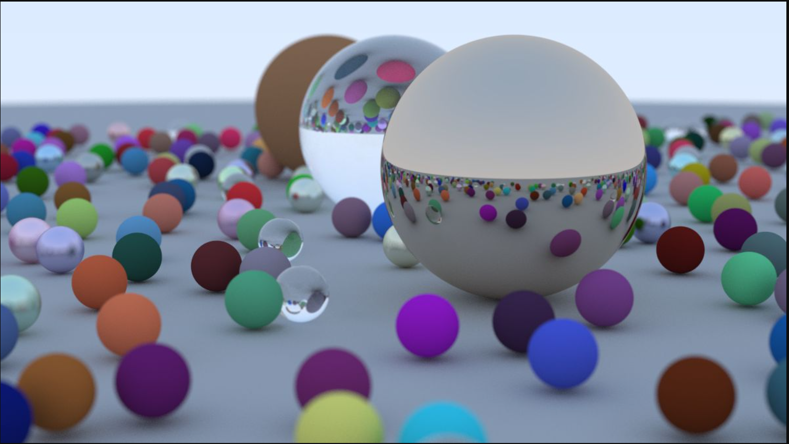

# Ray Tracing

A small C++ ray tracer: a CPU path tracer that renders a scene of randomly
scattered spheres (diffuse, metal, and glass materials) with a
depth-of-field camera, and writes the result as a PPM image.



## What's in here

| File | What it does |
|---|---|
| `raytracing.cpp` | Entry point. Builds the final "book cover" scene (a ground plane plus a field of small random spheres, with three large feature spheres) and renders it. |
| `camera.h` | The `camera` class: viewport/ray setup, defocus-blur (depth of field), anti-aliased sampling, and the render loop that writes a PPM image to stdout. |
| `vec3.h` | 3D vector/point/color math (`vec3`, `point3`, aliasing), including dot/cross product, random vectors, and reflection/refraction helpers. |
| `color.h` | `color` type (alias of `vec3`) plus `write_color`, which gamma-corrects and writes a pixel as PPM text. |
| `ray.h` | The `ray` class (origin + direction, `at(t)`). |
| `hittable.h` | `hittable` abstract base class and the `hit_record` struct (hit point, normal, material, `t`, front-face tracking). |
| `hittable_list.h` | `hittable_list`: a collection of `hittable` objects, itself hittable (used as the scene/world). |
| `sphere.h` | `sphere` class implementing ray-sphere intersection. |
| `material.h` | Material models: `lambertian` (diffuse), `metal` (reflective, with fuzz), `dielectric` (glass, via Schlick reflectance + refraction). |
| `interval.h` | `interval`: a simple `[min, max]` range helper used for clamping/surface-hit bounds. |
| `rtweekend.h` | Common utilities/constants (`infinity`, `pi`, `random_double`) and shared includes. |

## Building

No external dependencies — just a C++ compiler with C++11 or later.

```bash
g++ -O2 -std=c++17 raytracing.cpp -o raytracing
```

## Running

The renderer writes a [PPM](https://en.wikipedia.org/wiki/Netpbm#PPM_example)
image to stdout and progress to stderr, so redirect stdout to a file:

```bash
./raytracing > image.ppm
```

Scene and render settings (image size, samples per pixel, ray-bounce depth,
camera position/field of view, depth-of-field) are set directly in `main()`
in `raytracing.cpp`. The default scene renders at 1200px wide with 500
samples per pixel, which is slow (many minutes) on a single core — lower
`samples_per_pixel` or `image_width` for quick test renders.
